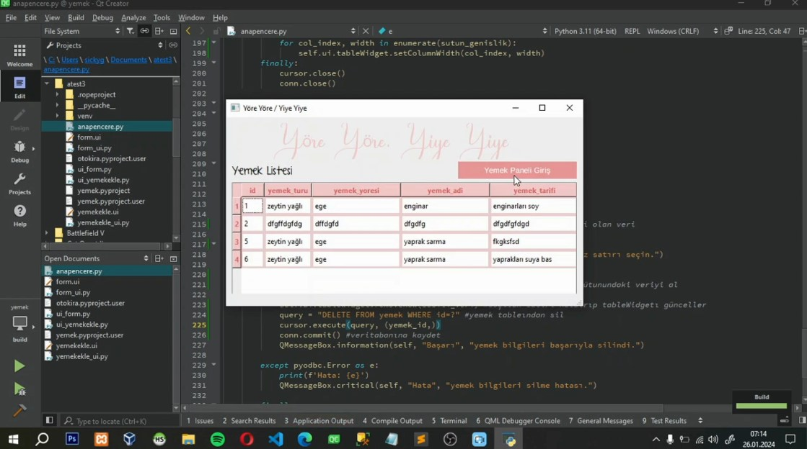
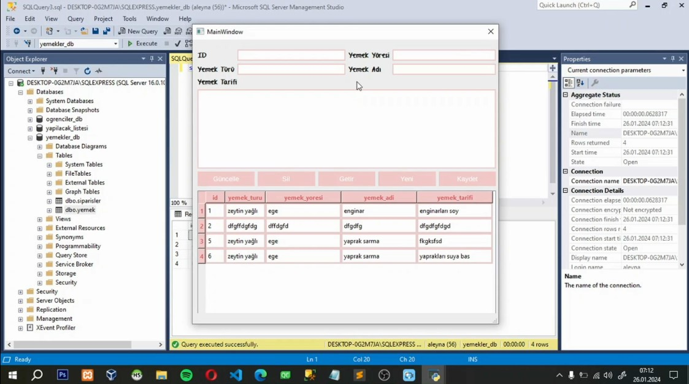

# Recipe-Collector
🍜 Recipe collector app built w/ Python, QT, MSSQL

```
TR. Microsoft SQL ve QT Creator ile Python dilinde 'Ekle, Sil, Güncelle, Görüntüle' işlemleri
EN. Operations of 'Insert, Delete, Update, View' in Python language with Microsoft SQL and QT Creator
```

> [!IMPORTANT]
> **yemek:** project files
> 
> **yemek/base:** QT Creator's virtual files
> 
> **yemekler_db.bak:** database
>
> **x/yemek.docx:** explanation
>


